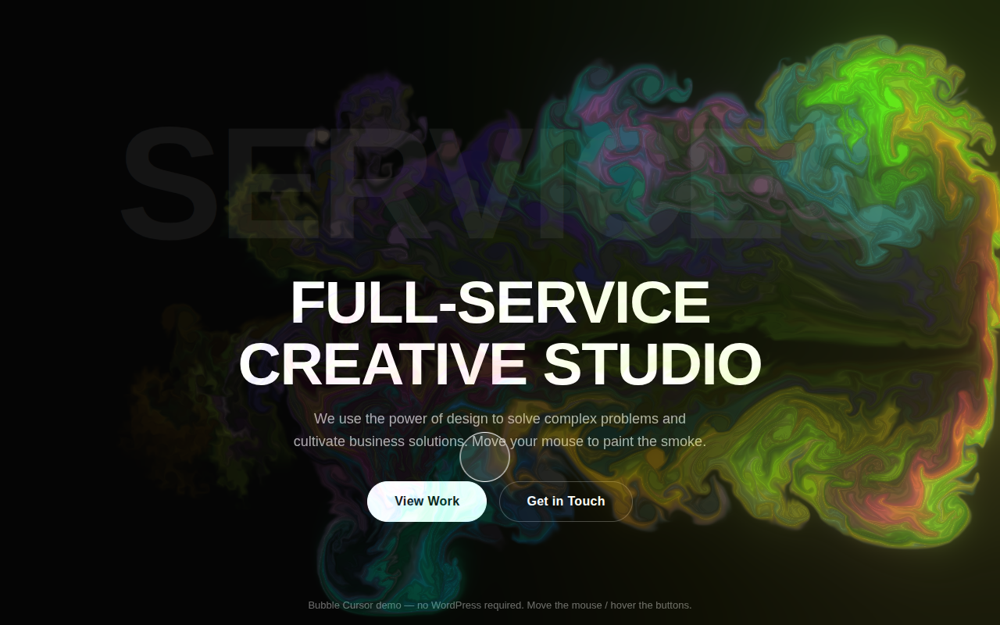
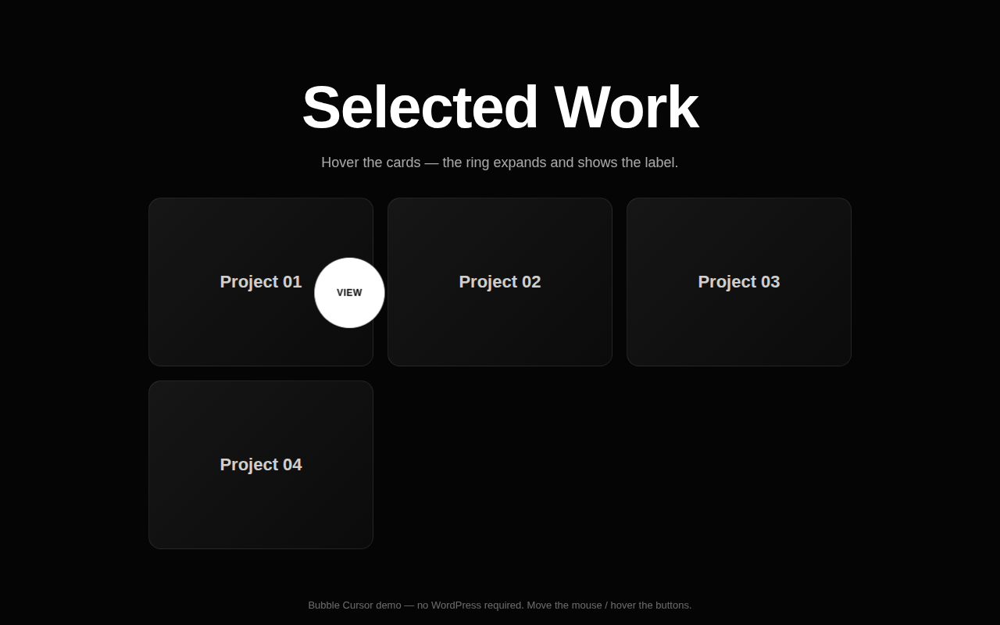

# Bubble Cursor — replicating the Deep theme "smokey" cursor

This repo answers a question: **can the cursor on
[preview.treethemes.com/elementor/deep/exposure](https://preview.treethemes.com/elementor/deep/exposure/)
be replicated in WordPress?** Short answer: **yes**, and it's included here as a
ready-to-install plugin.



## What that cursor actually is

Reading the saved page (`Exposure.html`), the effect is **two layers** added by
the TreeThemes *Deep* theme, not one:

1. **A WebGL "smoke" fluid trail.** The page loads `smokey-fluid-cursor.min.js`
   with a `deepFluidCursorConfig` of `BLOOM`, `COLORFUL`, `SPLAT_RADIUS`,
   `SPLAT_FORCE`, `DENSITY_DISSIPATION`… — the exact options of the open-source
   [WebGL-Fluid-Simulation by Pavel Dobryakov](https://github.com/PavelDoGreat/WebGL-Fluid-Simulation)
   (MIT licensed), which the [`smokey-fluid-cursor`](https://github.com/faraasat/smokey-fluid-cursor)
   library wraps. This is the colourful smoke you see near the hero.
2. **A custom dot + ring cursor ("demo2").** `deepCursorSettings` defines a
   white dot + ring that follow the mouse, plus a **"View"** label that appears
   when hovering links, buttons, and Elementor containers
   (`wcf_enable_cursor_hover_effect_text`).

Both are standard front-end techniques with **no server dependency**, so they
port cleanly to any WordPress site. The smoke engine is MIT-licensed, so it can
be bundled and redistributed.

## The bonus: it's a plugin

`bubble-cursor/` is a self-contained WordPress plugin that reproduces both
layers and exposes them through a settings screen — **no theme edits, no code**.

| Original (Deep demo) | This plugin |
| --- | --- |
| `smokey-fluid-cursor.min.js` (WebGL fluid) | `assets/js/fluid-cursor.js` (clean MIT port, configured to match) |
| `deepCursorSettings` dot + ring + "View" | `assets/js/bubble-cursor.js` |
| `deep-custom-cursor-*.css` | `assets/css/bubble-cursor.css` |
| Theme options | **Settings → Bubble Cursor** |

### Install

1. Zip the `bubble-cursor` folder (so the zip contains `bubble-cursor/bubble-cursor.php`).
2. WordPress admin → **Plugins → Add New → Upload Plugin** → choose the zip → **Activate**.
3. Open **Settings → Bubble Cursor**. Defaults already match the Deep demo.

You can also just copy the `bubble-cursor` folder into
`wp-content/plugins/` and activate it.

### What you can configure

* Master on/off, and whether it loads site-wide or on the front page only.
* Toggle each layer independently: smoke, ring, dot, and whether to hide the
  native OS cursor (the Deep demo keeps it visible — that's the default).
* Dot / ring colours, the hover word (default **View**), and the hover selector.
* **Smoke colours:** choose a colour mode — **Rainbow** (random, the original),
  **Palette** (pick up to 5 of your own colours/shades), or **Single** (one
  colour with automatic shade variation).
* **Adapt to background:** auto-invert the dot + ring so the cursor stays visible
  on both light and dark sections (white + "difference" blending).
* **Shape, size & transparency:** dot size, ring size, ring thickness, cursor
  opacity, and smoke opacity.
* **Smoke physics & intensity:** colourful on/off, bloom glow + intensity,
  smoke intensity/brightness, swirl, splat force, splat radius, density /
  velocity fade, a **Low / Medium / High** quality preset, and a blend mode
  (e.g. *screen* / *lighten* to keep text readable).
* **Extra effects (all opt-in):** magnetic ring that hugs buttons, click burst
  (smoke puff + ripple), elastic ring, **image preview** (a portfolio item's
  image follows the cursor), and **adaptive performance** (auto-eases quality
  on slow frames + pauses in background tabs).
* **Quick presets:** one-click looks — Neon, Mono, Minimal, Smoke only.

### Won't crash your site

The engine is built defensively for live use: GPU framebuffers are freed on
every resize (no memory leak), resize handling is debounced, WebGL context-loss
is handled, and both the render loop and the front-end init are wrapped so a
cursor error fails silently instead of taking the page down. It also bails on
touch devices, respects "reduced motion", and does nothing if the browser has
no WebGL.

### Per-element hover text (optional)

Add an attribute to any element to control the hover bubble:

```html
<a href="/work" data-bubble-cursor-text="Open">My project</a>
<div data-bubble-cursor-hover>Triggers the enlarged ring</div>
```

Elementor containers that already use the **Cursor Hover Effect Text** setting
are detected automatically.

## Try it without WordPress

`demo/index.html` is a standalone page that loads the plugin's real CSS/JS —
open it in any browser (Chrome/Firefox/Safari/Edge) to see the effect with no
WordPress needed:

```bash
# from the repo root
php -S 127.0.0.1:8765
# then visit http://127.0.0.1:8765/demo/index.html
```



## Notes on behaviour

* **Touch devices:** the cursor is disabled — a fluid mouse trail is meaningless
  on a touchscreen.
* **Reduced motion:** if a visitor's OS requests reduced motion, the heavy smoke
  layer is skipped.
* **No WebGL:** the smoke silently does nothing; the dot/ring still work.
* **Performance:** the simulation runs at a capped device-pixel-ratio and pauses
  cleanly on page unload.

## Development, testing & releasing

* **`HANDOFF.md`** — full architecture, data flow, feature/option map, and a
  distribution checklist (GitHub / WordPress.org / selling). Start here to
  continue the project.
* **`tests/`** — run `php tests/php/bridge-test.php` and
  `php tests/php/render-test.php` (no browser needed), plus a headless-Chromium
  front-end suite. See `tests/README.md`.

## Credits & license

* Plugin code: GPL-2.0-or-later (matching WordPress).
* Bundled WebGL fluid engine: adapted from
  [WebGL-Fluid-Simulation](https://github.com/PavelDoGreat/WebGL-Fluid-Simulation)
  by Pavel Dobryakov, MIT License — see
  [`bubble-cursor/assets/js/LICENSE-fluid.txt`](bubble-cursor/assets/js/LICENSE-fluid.txt).

`Exposure.html` and the screenshot in this repo are the original reference
material used to identify the effect.
