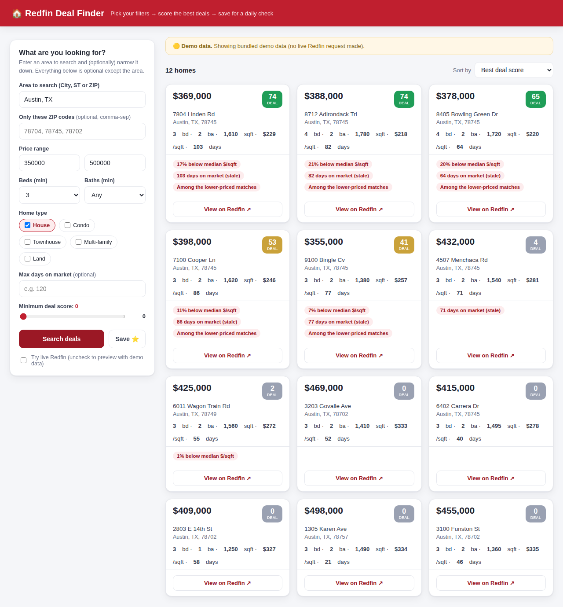

# 🏠 Redfin Deal Finder

A small app with a **point-and-click UI** to hunt for real-estate deals on Redfin.
Pick a price range, ZIP codes, beds/baths, and home type — it pulls matching
listings, **scores each one as a "deal,"** and can save your search so a daily
script emails you fresh hits.



---

## ⚠️ Read this first (it explains *why it runs on your computer*)

Redfin has **no official public API** and **actively blocks data-center / cloud
IP addresses**. That means this app can't run on a cloud server and reach live
Redfin data — it has to run on **your own computer** (a normal home internet
connection), which Redfin treats like any other visitor.

If a live request is ever blocked, the app **doesn't break** — it falls back to
bundled **demo data** and clearly labels it 🟡 in the UI, so you can still see
exactly how everything works. To guarantee live data even on a flaky network,
you can plug a scraper API (Apify / HasData) into one function — see
[Troubleshooting](#-troubleshooting).

---

## ▶️ Quick start (about 2 minutes)

You need **Python 3.9+** installed ([python.org/downloads](https://www.python.org/downloads/) —
on Windows, tick *"Add Python to PATH"* during install).

### Windows
1. Download/clone this folder.
2. **Double-click `run.bat`.**
3. Your browser opens to `http://127.0.0.1:5000`. Done.

### Mac / Linux
1. Open Terminal in this folder.
2. Run: `bash run.sh`
3. Your browser opens to `http://127.0.0.1:5000`. Done.

The first run installs a couple of small packages automatically; later runs are
instant. To stop the app, press `Ctrl + C` (Mac/Linux) or close the window (Windows).

---

## 🕹️ Using it

1. **Area to search** — type a city (`Austin, TX`) or a ZIP (`78704`). *(required)*
2. Optionally narrow with **ZIP list, price range, beds/baths, home type, max days on market.**
3. Click **Search deals**.
4. Results come back as cards, each with a **0–100 deal score** and the reasons
   it scored that way. Use **Minimum deal score** to hide the weak ones, and
   **Sort by** to reorder.
5. Click **Save ⭐** to store these filters for the daily digest (below).

### How the deal score works (it's transparent, not magic)
For the set of homes your search returns, each listing earns points for:
| Signal | Weight | Meaning |
|---|---|---|
| **$/sqft below the area median** | up to 55 | The strongest "underpriced" signal |
| **Days on market above median** | up to 25 | Stale listing → often a motivated seller |
| **Lower-priced among your matches** | up to 20 | Relative affordability in this search |

> Note: "below the **Redfin Estimate**" and "recent **price drop**" aren't in
> Redfin's bulk export, so they're not scored yet. They'd require per-listing
> detail calls — a sensible next upgrade if you want it.

---

## 📅 Make it run every day automatically

1. In the UI, set your filters and click **Save ⭐** (creates `saved_search.json`).
2. Test the digest once: `python daily_digest.py` → writes `digest.html`.
3. (Optional) Get it **emailed** to you — set these environment variables first:
   `SMTP_HOST`, `SMTP_PORT` (default 587), `SMTP_USER`, `SMTP_PASS`, `DIGEST_TO`.
   (For Gmail, use an [App Password](https://support.google.com/accounts/answer/185833).)
4. Schedule it:
   - **Mac/Linux** — `crontab -e`, then add (runs 8am daily):
     ```
     0 8 * * *  cd /full/path/to/redfin-deal-finder && /full/path/to/python daily_digest.py
     ```
   - **Windows** — Task Scheduler → Create Basic Task → Daily → *Start a program* →
     Program `python`, Arguments `daily_digest.py`, *Start in* this folder.

> Your computer must be **on and awake** at the scheduled time for the daily run.

---

## 🤖 Prefer to just *ask* in plain English? (the MCP option)

If you'd rather type *"3-bed under $400k in 78704, price dropped this month"*
into Claude instead of using a form, connect a **pre-built Redfin MCP server**.
This needs a free [Apify](https://apify.com) account for the token.

**Hosted (easiest)** — in Claude Desktop → Settings → Connectors → *Add custom
connector*, point it at `https://mcp.apify.com` and authenticate; then enable a
Redfin actor (e.g. `nexgendata/redfin-real-estate-scraper`).

**Local config** — add to `claude_desktop_config.json`, then fully quit & reopen Claude:
```json
{
  "mcpServers": {
    "redfin": {
      "command": "npx",
      "args": ["-y", "@apify/actors-mcp-server", "--actors", "nexgendata/redfin-real-estate-scraper"],
      "env": { "APIFY_TOKEN": "YOUR_APIFY_TOKEN" }
    }
  }
}
```
An MCP gives you a **chat** interface (no sliders) — it's complementary to this app's form UI. Setup docs: [Apify MCP for Claude Desktop](https://docs.apify.com/platform/integrations/claude-desktop).

---

## 🧰 Troubleshooting

- **Banner shows 🟡 "Demo data" even at home.** Live request was blocked/rate-limited.
  Wait a bit and retry, or wire a scraper API into `_fetch_live_csv()` in
  `redfin_client.py` — it only needs to return CSV with Redfin's standard
  "Download All" columns. [Apify Redfin scraper](https://apify.com/nexgendata/redfin-real-estate-scraper/api) ·
  [HasData](https://docs.hasdata.com/apis/redfin/listing).
- **`python` not found.** Reinstall Python and tick *Add to PATH* (Windows), or use `python3`.
- **Port 5000 busy.** Run with a different port: `PORT=5050 python app.py`.

---

## 📁 What's in here
```
app.py            Web server + UI endpoints (run this)
redfin_client.py  Fetches Redfin, normalizes, scores deals (live + demo fallback)
templates/        The point-and-click web page
daily_digest.py   Daily run → digest.html + optional email
sample_data.csv   Demo listings so the app works before you go live
run.sh / run.bat  One-command launchers
```

## ⚖️ A note on terms
Redfin's data is publicly viewable, but automated access lives in a gray area of
their Terms of Service. This tool is for personal, low-volume, human-paced use.
For anything heavier or commercial, use a licensed data provider or a compliant
scraper API with its own terms.
